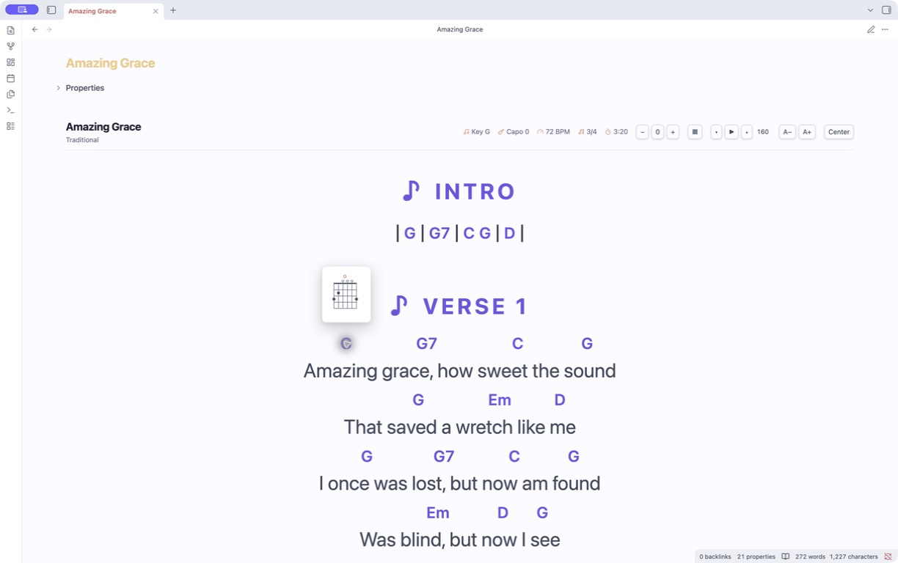
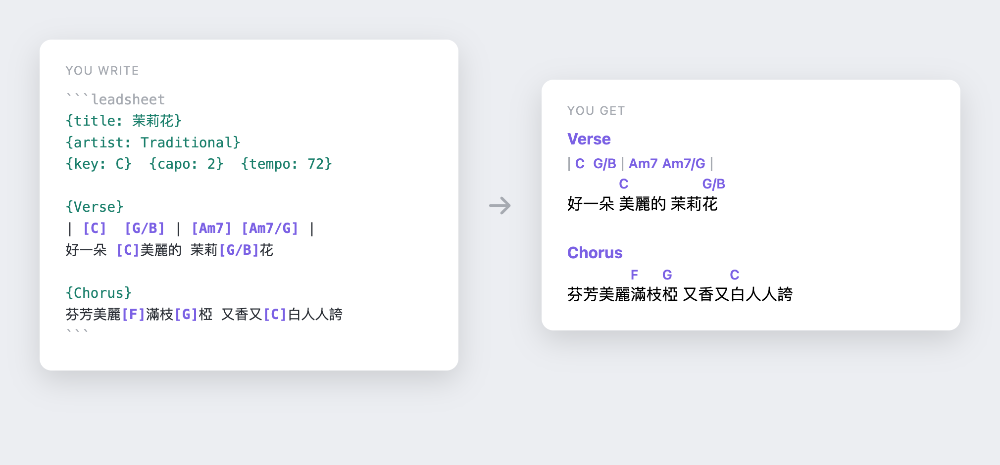

# Leadsheet

[](https://github.com/chrisamber/obsidian-leadsheet/actions/workflows/ci.yml)

Turn Obsidian notes into performance-ready lead sheets. Render ChordPro with
per-file transpose, capo-aware shapes, guitar chord diagrams, set lists, and
hands-free autoscroll. Chords align per-syllable, so CJK lyrics work without
monospace tricks.



## Features

- **Chord-over-lyric rendering** aligned per-syllable — CJK-safe, no
  fixed-width fonts.
- **Transpose** per file, with sharps vs flats following the target key
  signature.
- **Capo-aware shapes** — toggle between concert *sounding* pitch and the
  *shapes* your hands play.
- **Chord diagrams** — toggle a strip of guitar fretboard fingerings for every
  chord in the song, following transpose and capo mode.
- **Autoscroll** paced from the song's `duration`, with tap-to-pause, a
  music-stand **performance mode**, and font sizing.
- **Set lists** — one continuous, scrollable view over several songs with
  Prev/Next.
- **Authoring aids** — paste-convert chords-over-lyrics, `{Chorus: repeat}`
  shorthand, and live invalid-chord underlining.
- **CLI** — validate, transpose, export to JSONL, and derive
  chord-progression frontmatter.

## Usage

Put a song in a `leadsheet` code block, and reading view renders it:



````markdown
```leadsheet
{title: 茉莉花}
{artist: Traditional}
{key: C}
{tempo: 72}

{Verse}
| [C]  [G/B] | [Am7] [Am7/G] |
好一朵 [C]美麗的 茉莉[G/B]花
```
````

The toolbar gives you:

- **− / +2 / +** — transpose down/reset/up. The offset is remembered per file.
  The displayed key updates; flats vs sharps follow the target key signature.
- **▶ / ⏸** — autoscroll the note (also the hotkeyable command *Leadsheet:
  Toggle autoscroll*). **▾ / ▴** adjust speed (px/s, in settings too). If the
  song's frontmatter has `duration:` (seconds), ▶ paces the whole sheet over
  that time. Tap the sheet body to pause.
- **A− / A+** — grow/shrink the leadsheet font (global). *Leadsheet: Toggle
  performance mode* hides the app chrome for music-stand use.
- **Sounding / Shapes** — with a `capo:` set, toggle between concert pitch and
  the shapes your hands play. Bad capo values (outside 0–11) are flagged and
  clamped.
- **▦** — show/hide guitar chord diagrams for every chord used in the song
  (standard tuning). Diagrams follow the current transpose offset and the
  Sounding/Shapes capo mode, so in Shapes mode they show the grips you
  actually play. Unrecognized chords (e.g. `N.C.`) are skipped.

## Set lists

A `setlist` code block renders several songs as one continuous, scrollable view
with Prev/Next navigation:

````markdown
```setlist
- [[Song A]]
- [[Song B]]
```
````

## Authoring

- *Leadsheet: Convert selection: chords-over-lyrics → inline* rewrites a pasted
  Ultimate-Guitar-style block (chords on their own line above the lyric) into
  inline `[C]` chords.
- `{Chorus: repeat}` re-emits an earlier section instead of pasting it again.
  Multi-word names work too: `{Chorus 2: repeat}`.
- Invalid chord tokens are wavy-underlined in the editor.

See [SPEC.md](SPEC.md) for the full schema.

## Install

### Public beta with BRAT

1. Install [BRAT](https://github.com/TfTHacker/obsidian42-brat) from Community
   plugins.
2. In BRAT settings, select **Add beta plugin**.
3. Enter `https://github.com/chrisamber/obsidian-leadsheet` and enable
   **Leadsheet**.

The Community Plugins submission is in progress. Once approved, search for
**Leadsheet** under Settings → Community plugins.

### Manual install

1. Download `main.js`, `manifest.json`, and `styles.css` from a
   [GitHub release](https://github.com/chrisamber/obsidian-leadsheet/releases).
2. Copy them into `<vault>/.obsidian/plugins/leadsheet/`.
3. Enable **Leadsheet** under Settings → Community plugins.

Please report beta feedback and bugs through
[GitHub Issues](https://github.com/chrisamber/obsidian-leadsheet/issues).

## CLI

```sh
# report unrecognized chord tokens
node cli.mjs validate "My Song.md"
# rewrite chords + {key:} in place
node cli.mjs transpose +2 "My Song.md"
# dump song(s) as JSONL (frontmatter + sections)
node cli.mjs export "My Song.md"
# write chords_used + roman progression to frontmatter
node cli.mjs annotate "My Song.md"
```

## Development

```sh
npm install
npm test        # esbuild + tsc + node --test
```

`npm run build` emits `main.js` (the plugin) and per-module `.mjs` bundles used
by the CLI and tests.

## License

[MIT](LICENSE) — © 2026 chrisamber.

The example song *茉莉花 (Jasmine Flower)* is a traditional folk song in the
public domain.
