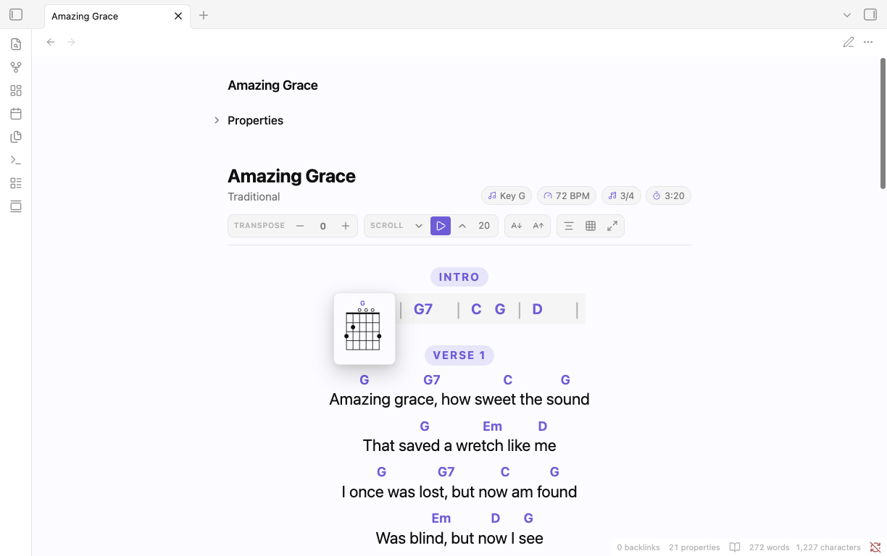
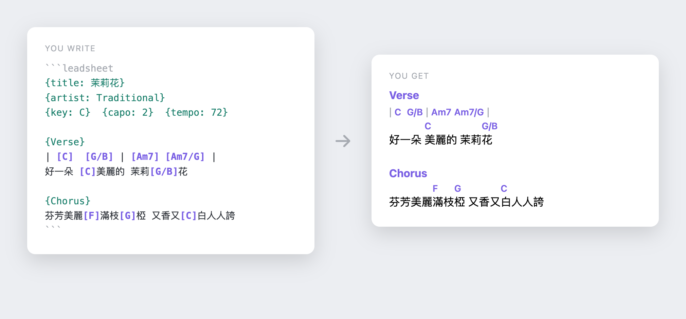

# Leadsheet

[](https://github.com/chrisamber/obsidian-leadsheet/actions/workflows/ci.yml)

Turn Obsidian notes into performance-ready lead sheets. Render ChordPro with
per-file transpose, capo-aware shapes, guitar chord diagrams, set lists, and
hands-free autoscroll. Chords align per-syllable, so CJK lyrics work without
monospace tricks.



## Features

- **Chord-over-lyric rendering** aligned per-syllable — CJK-safe, no
  fixed-width fonts.
- **Transpose** per file, with sharps vs flats following the target key
  signature.
- **Capo-aware shapes** — toggle between concert *sounding* pitch and the
  *shapes* your hands play.
- **Chord diagrams** — hover, focus, or tap a chord for its guitar fingering,
  or toggle a strip for the whole song. Both follow transpose and capo mode.
- **Autoscroll** paced from the song's `duration`, with tap-to-pause, a
  music-stand **performance mode**, and font sizing.
- **Set lists** — one continuous, scrollable view over several songs with
  Prev/Next.
- **Authoring aids** — paste-convert chords-over-lyrics, `{Chorus: repeat}`
  shorthand, and live invalid-chord underlining.
- **CLI** — validate, transpose, export to JSONL, and derive
  chord-progression frontmatter.

## Quick start

After enabling Leadsheet:

1. Create or open a note.
2. Open Obsidian's command palette and run **Leadsheet: Insert starter
   leadsheet**. On iPad, open the command palette from the mobile menu.
3. Edit the starter text, then tap outside the block or switch to Reading view.
   Tap any chord to open its diagram.

You can also copy this starter template directly:



````markdown
```leadsheet
{title: My Song}
{artist: Artist}
{key: C}
{capo: 0}
{tempo: 72}
{time: 4/4}

{Verse}
| [C] | [F] [G] |
[C]Write your lyrics [F]here

{Chorus}
[F]Add a chorus [G]here [C]too
```
````

The toolbar groups related controls:

- **Transpose − / 0 / +** — transpose down/reset/up. The offset is remembered
  per file. The key chip updates; flats vs sharps follow the target key
  signature. With a `capo:` set, **Shapes** at the end of the group switches
  from concert (sounding) pitch to the shapes your hands play. Bad capo values
  (outside 0–11) are flagged and clamped.
- **Scroll ⌄ ▶ ⌃** — autoscroll the note (also the hotkeyable command
  *Leadsheet: Toggle autoscroll*). The chevrons adjust speed (px/s, shown
  beside them and in settings). If the song's frontmatter has `duration:`
  (seconds), ▶ paces the whole sheet over that time. Tap the sheet body to
  pause.
- **Text size** — shrink/grow the leadsheet font (global).
- **Alignment** — switch the sheet between left and centered (global).
- **Chord diagrams** — show/hide guitar chord diagrams for every chord used in
  the song (standard tuning). Diagrams follow the current transpose offset and
  the Shapes toggle, so with Shapes on they show the grips you actually play. Unrecognized chords (e.g. `N.C.`) are skipped.
- **Performance mode** — hides the app chrome and note properties and titles,
  pins the toolbar while the sheet scrolls, and keeps the screen awake
  when the platform supports Screen Wake Lock. Also available as *Leadsheet:
  Toggle performance mode*.
- **Chord popovers** — hover, keyboard-focus, or tap a recognized chord to see
  its current fingering without showing the full diagram strip.

Choruses (`{Chorus}`, `{Refrain}`, `{副歌}`) get a filled label and a margin
bar so the hook is easy to find mid-song, and chord-only lines such as
`| [G] | [G7] | [C] [G] | [D] |` render as a measure strip.

## Set lists

A `setlist` code block renders several songs as one continuous, scrollable view
with Prev/Next navigation. The header shows the song count, total known
duration, and missing songs, and its position label follows you as you scroll.
Each song's name links to its note; a missing note is flagged and can be
created with a click.

````markdown
```setlist
- [[Song A]]
- [[Song B]]
```
````

## Authoring

- *Leadsheet: Convert selection: chords-over-lyrics → inline* rewrites a pasted
  Ultimate-Guitar-style block (chords on their own line above the lyric) into
  inline `[C]` chords.
- `{Chorus: repeat}` re-emits an earlier section instead of pasting it again.
  Multi-word names work too: `{Chorus 2: repeat}`.
- Invalid chord tokens are marked in the editor.

See [SPEC.md](SPEC.md) for the full schema.

## Styling

Leadsheet follows your theme's colors and fonts. To retune it without
overriding selectors, set these variables in a
[CSS snippet](https://help.obsidian.md/snippets):

```css
body {
  --ls-accent: #6b57e0;        /* chords, section labels, active controls */
  --ls-chord-color: #6b57e0;   /* chord names (defaults to --ls-accent) */
  --ls-section-color: #6b57e0; /* section labels (defaults to --ls-accent) */
  --ls-lyric-size: 1.3em;      /* base lyric size before the text-size buttons */
}
```

## Install

### Community Plugins

1. Open **Settings → Community plugins** in Obsidian and select **Browse**.
2. Search for **Leadsheet**, then select **Install** and **Enable**.

### Beta updates with BRAT

1. Install [BRAT](https://github.com/TfTHacker/obsidian42-brat) from Community
   plugins.
2. In BRAT settings, select **Add beta plugin**.
3. Enter `https://github.com/chrisamber/obsidian-leadsheet` and enable
   **Leadsheet**.

### Manual install

1. Download `main.js`, `manifest.json`, and `styles.css` from a
   [GitHub release](https://github.com/chrisamber/obsidian-leadsheet/releases).
2. Copy them into `<vault>/.obsidian/plugins/leadsheet/`.
3. Enable **Leadsheet** under Settings → Community plugins.

Please report beta feedback and bugs through
[GitHub Issues](https://github.com/chrisamber/obsidian-leadsheet/issues).

## CLI

```sh
# report unrecognized chord tokens
node cli.mjs validate "My Song.md"
# rewrite chords + {key:} in place
node cli.mjs transpose +2 "My Song.md"
# dump song(s) as JSONL (frontmatter + sections)
node cli.mjs export "My Song.md"
# write chords_used + roman progression to frontmatter
node cli.mjs annotate "My Song.md"
```

## Development

```sh
npm install
npm test        # esbuild + tsc + node --test
```

`npm run build` emits `main.js` (the plugin) and per-module `.mjs` bundles used
by the CLI and tests.

## Credits

Chord diagram popovers were inspired by
[Obsidian Chord Sheets](https://github.com/olvidalo/obsidian-chord-sheets) by
Marcel Schaeben.

## License

[MIT](LICENSE) — © 2026 chrisamber.

The example song *茉莉花 (Jasmine Flower)* is a traditional folk song in the
public domain.
